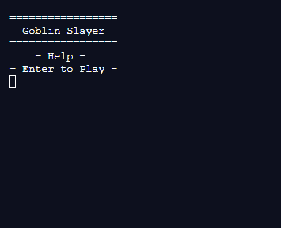

# GSlayer
Wrote a Python text and turn based role-playing (RPG) game to learn more about game development  
  
Utilized Random Number Generator (RNG) from Python random library to create random values created classes for players and enemies, and used Python os and sys library to clear and update the console with new values printed on the console  
  

# Usage
For your convenience, here is how you could do it in CMD environment.

1. First compile: gcc gslayer.c
2. After compilation, to run the program, you would type the following command: a.exe

# How to play
Input 1-4 to progress through the game and beat the Goblin Lord at Level 10

# Start Menu
~~~
=================
  Goblin Slayer  
=================
    - Help -     
- Enter to Play -
~~~

# Interface
~~~
Level: 1

Lv. 1               Lv. 1
Goblin Slayer       Goblin              
HP:100/100          HP: 20/20 
Mana: 25/25
----------------------------------------
1. Attack
2. Skills
3. Potion
4. Run
> 
~~~

# Inspiration
Goblin Slayer anime

